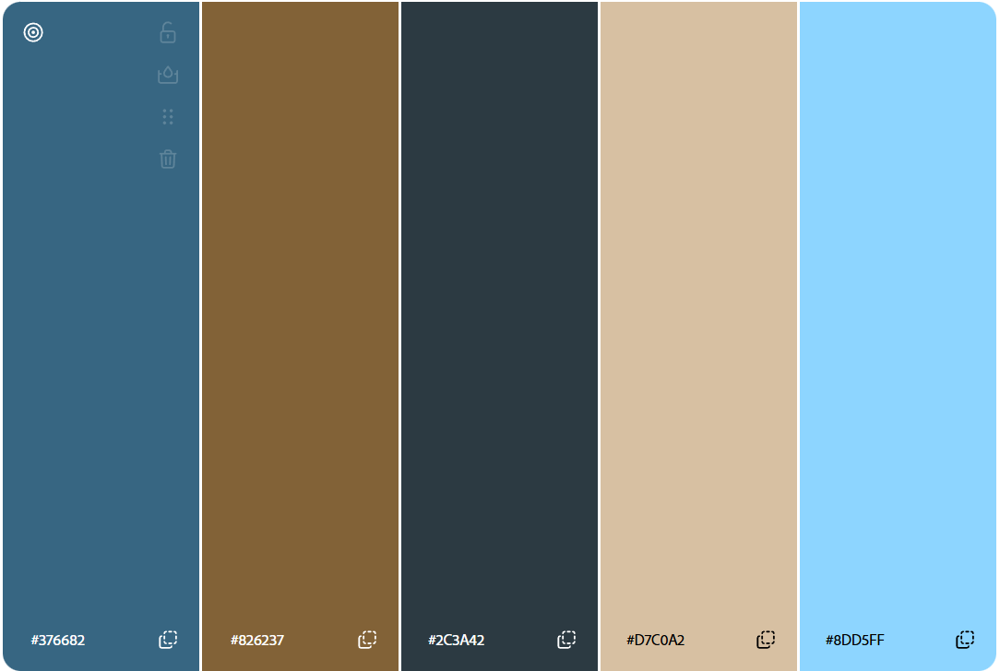

Owen Nguyen https://a1-owennguyen.onrender.com/

This project shows my personal information, including class, school, major, previous CS courses, Experience, and personal links.

## Technical Achievements
- **Styled page with CSS**: Added rules for the body, h1, h2, footer, footer p, @media footer p, a, and img selectors:
    - `body`
        - Sets the font to Anonymous Pro, gives a max width of 800px and horizontally centers it, and sets text/bg colors.
    - `h1`
        - Gives a border around h1, sets text/bg colors, and aligns the text to the center.
    - `h2`
        - Gives a border around h2, sets text/bg colors, and aligns the text to the center.
    - `footer`
        - Gives a border around footer.
    - `footer p`
        - Relating to the p descendant of footer; Starting in small screen veiwing like the textbook described, position the elements in a column (and center it horizontally).
    - `@media footer p`
        - Relating to the p descendant of footer; For screens 600px and up, position the elements in a row (and center it horizontally).
    - `a`
        - Sets the color and removes underline.
    - `img`
        - Displays img 50% of the original size, positions on the left side of the screen.
- **Added a simple javascript animation**:
    - Was difficult to figure out the logic to animate the color.
        - Learned hex color, sine logic, and animation information from: https://krazydad.com/tutorials/makecolors.php and https://developer.mozilla.org/en-US/docs/Web/API/Window/requestAnimationFrame.
    - The `<h1>` background color shifts (using a sine wave) slightly between blue hues using a `requestAnimationFrame` loop.
    - The first 4 hex digits stay the same, while the last 2 (the blue portion) oscilate via `Math.round(130 + Math.sin(t) * 20)`.
- **Used other semantic HTML tags**:
    - `<a>`: Links to my Github, LinkedIn, WPI, and Home (just scrolls to the top).
    - `<footer>`: Contains the above anchor tags at the bottom of the page.
    - ``: Image of the color palette used in this site.
    - `<abbr>`: Abbreviates BS/MS by showing "Bachelor of Science & Master of Science 4 Year Combined Program" on hover.
    - `<nav>`: Wrapped in the footer; the navigation section of the webpage including links for Github, LinkedIn, WPI, and Home.

## Design Achievements
- **Used this color palette:** I used this color palette created at color.adobe.com as colors for my site.

- **Used the Anonymous Pro Font from Google Fonts**: I used Anonymous Pro as the font for the text in my site.